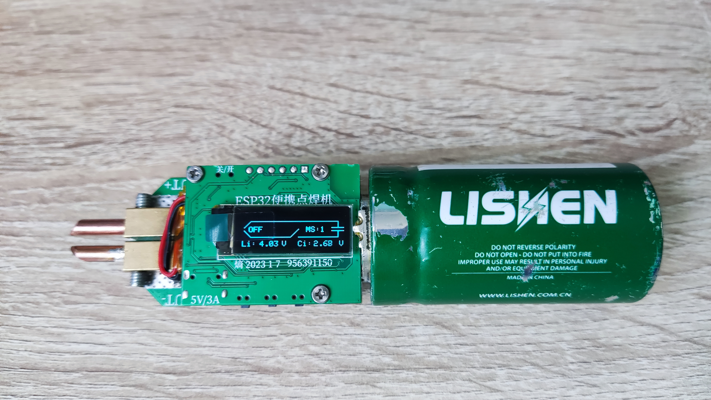
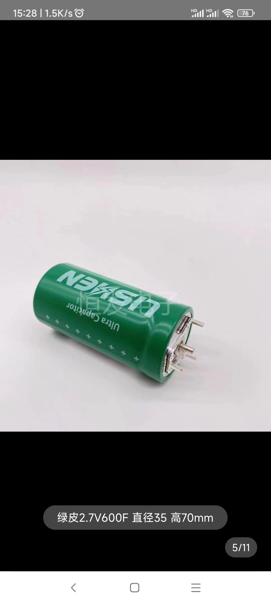
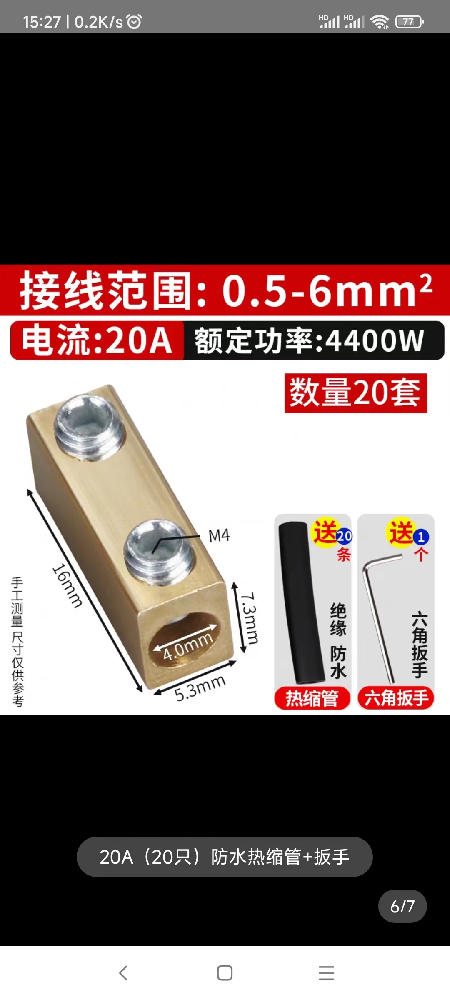

# ESP32便携点焊机
#### ESP32便携点焊机是一款迷你便携能单手操控的超级电容点焊机  采用单节2.7V超级电容作为点焊电源 并辅以锂电池为控制器和电容供电来弥补超级电容焊接时电压波动大和续航短的缺点  使用三个大电流低内阻的NMOS作为点焊开关并使用专用驱动控制 减小导通损耗

#### 功能简介
1.  TYPE-C接口支持程序烧录串口打印和为设备充电
2.  内置TYPE-C-->电容（2.5A）和 锂电池-->电容（0.8A）两路恒流充电电路 并能控制开关。
3.  支持USB电压 电池电压 电容电压和 焊件检测 
4.  0.96寸 OLED显示屏 显示各种参数
5.  3个按键进行功能切换 参数设置   一个拨动开关控制开关机
6.  拥有防超级电容电流倒灌电路 减小电容待机漏电流
7.  支持双脉冲焊接和焊接时间设置  

#### 功能模式
1.  自动模式：自动检测到焊件就位并启动焊接时间流程
2.  手动模式：模式1 检测到按键按下就执行一次焊接流程，模式2检测到按键按下就开启NMOS离开就关闭
3.  时间设置模式：通过按键选择设置 焊接时间流程中的 等待焊接时间 和 焊接时间 等时间参数
4.  其他设置模式：通过按键选择切换  LED照明开关  设置保存开关  屏显方向切换开关等

#### 程序下载
1.  程序基于Arduino IDE 开发  编译上传之前需要把相关依赖库文件添加好  选择对应的芯片和模式选项 才能编译成功 
2.  源程序和依赖库在附件内  还有Arduino 编译导出的bin文件

 
#### 注意事项
1.  PCB 打样2层板  板厚1.6mm  元件参数以原理图为准 嘉立创没有的元件上淘宝   相关软硬件资料都在附件内
2.  ESP32便携点焊机主要由主控PCBA + 功率板PCBA + 超级电容 +锂电池 + 焊针夹具和焊针 + 导流铜板 + M2铜柱螺丝组成
3.  我使用的超级电容是 拆机的美国力神2.7V 350F （4引脚封装）超级电容  推荐使用同样引脚封装的更大容量和更低内阻的电容
4.  焊针夹具 由于CNC定制太贵用不起  只能使用便宜黄铜材质的：  方型一进一出接线端子 (16*7.3*5.3mm）作为替代详情看展示图片
5.  锂电池 只要能塞得下 容量当然是越大越好 没啥特别需求 别太小就行
6.  导流铜板 只要能塞得下越大越好  还是由于CNC定制太贵 我用几根紫铜电线剥皮焊上凑合着用 建议还是用紫铜板
7.  实物图片是最初验证版  1.0版只是增加恒流充电电路  由于星火计划白嫖嘉立创PCB+SMT没成功 且不想手焊0402的元件 只好将就用着
8.  由于便宜货用的太多了 拆机电容内阻 +焊针夹具内阻有点大 导致0.2mm的镍片有点焊不牢  0.1mm的还可以 介意的谨慎复刻
9.  内阻瞎估算  超级电容3.5mR + 导流铜板1mR + 焊针夹具8mR + NMOS 0.3mR  + 焊锡0.2mR 大概13mR 左右 大概瞬时能输出2.6V/0.013 = 200A

#### 其他平台
1. 立创开源平台： https://oshwhub.com/fj956391150/esp32-pian-xie-dian-han-ji
2. 熵 2023-2-25
 
#### 实物展示

